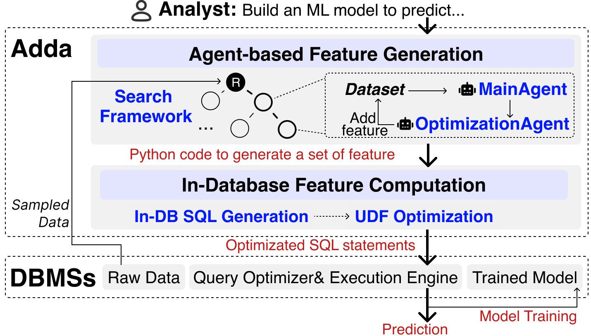

# Adda

In this repo, we introduce Adda, an automated feature engineering tool supported by agent collaboration.

<div style="text-align: center;">

</div>

## 📄 Publications

- **Demo Paper**: [Adda: An LLM-based Multi-agent System for Automatic Feature Engineering](https://dl.acm.org/doi/10.1145/3788853.3801606) — SIGMOD 2025
- **Research Paper**: [Scaling Automatic Feature Engineering via In-Database Machine Learning](https://dl.acm.org/doi/10.1145/3725262) — SIGMOD 2026
- **Poster**: [Download PDF](./img/Adda_SIGMOD_Demo_Poster_A0_ReportLab_0.54.pdf)

## 🐳 Docker Quick Start

### Option 1: Pull Pre-built Images

```bash
# Download compose file and config
wget https://raw.githubusercontent.com/zhyangcs/Adda/main/docker-compose.ghcr.yml -O docker-compose.yml
wget https://raw.githubusercontent.com/zhyangcs/Adda/main/.env.example -O .env

# Edit .env to set your OPENAI_API_KEY
docker compose up -d
# Visit http://localhost
```

**Package links:**
- [adda-app](https://github.com/users/li-zhenyu0511/packages/container/adda-app)
- [adda-db](https://github.com/users/li-zhenyu0511/packages/container/adda-db)

### Option 2: Build from Source

```bash
git clone https://github.com/zhyangcs/Adda.git
cd Adda
cp .env.example .env
# Edit .env to set your OPENAI_API_KEY
docker compose build
docker compose up -d
# Visit http://localhost
```

## Project Structure

```
autofe/
├── src/                          # Source code directory
│   ├── llm/                      # LLM-related modules
│   │   ├── agents/               # AI agents
│   │   ├── tests/                # Test utilities
│   │   └── utils/                # Utility functions
│   ├── clib/                     # C++ library components
│   └── env.py                    # Environment configuration
├── benchmark/                    # Benchmark testing tools
│   ├── adda_benchmark_test.py    # Core benchmark framework
│   ├── run_benchmark_example.py  # Interactive test launcher
│   ├── test_openai_simple.py     # Simple OpenAI testing
│   ├── test_openai_prompt.py     # Complete OpenAI testing
│   ├── watch_logs.py            # Log monitoring utility
│   ├── logs/                     # Benchmark test logs
│   └── results/                  # Benchmark test results
├── dataset/                      # Dataset storage
├── test/                         # Test results and outputs
├── frontend/                     # Frontend components
├── pd2sql/                       # Pandas to SQL conversion
├── img/                          # Images and diagrams
├── logs/                         # Log files
├── report/                       # Generated reports
├── requirements.txt              # Python dependencies
├── README.md                     # English documentation
└── README-zh.md                  # Chinese documentation
```

## Prerequisites

### 1. Install Python Libraries
```sh
pip install -r requirements.txt
```
You should install the suitable `torch` version considering your GPU.

### 2. Install C++ Libraries
You should install `armadillo` and `postgres database` to the server.

### 3. Configure Environment Variables
In `src/env.py` you can set the project configurable variables, especially `openai_api_key` and `rag_model_id_or_path`.

### 4. Configure pl/python Environment
If using conda environment, there may be inconsistency between the pl/python3 interpreter and the conda python interpreter. In this case, use the following commands:

```bash
# General installation command
/usr/bin/python3 -m pip install pandas scikit-learn xgboost lightgbm

# Or
sudo -u pip install pandas scikit-learn xgboost lightgbm

# If you are root user
su - postgres -c "pip install pandas scikit-learn xgboost lightgbm"
```

## Code Execution Example

### 0. Start PostgreSQL Service

#### Using System-installed PostgreSQL
```bash
service postgresql start
```

#### Using Conda-installed PostgreSQL
If PostgreSQL is installed through conda, the startup process is as follows:

1. **Activate Conda Environment**
First, ensure you have activated the Conda environment where PostgreSQL is installed:
```bash
# Assuming your environment is named autofe
conda activate autofe
```

2. **Initialize Database (First time only)**
```bash
# Create data directory
mkdir -p ~/conda_postgres_data

# Initialize database
initdb -D ~/conda_postgres_data
```

3. **Start PostgreSQL Service**
Use `pg_ctl` command to start the service:
```bash
# -D specifies the data directory
# -l specifies the log file path, which is very useful for troubleshooting
pg_ctl -D ~/conda_postgres_data -l ~/conda_postgres_logfile start
```

If successful, you'll see:
```
waiting for server to start.... done
server started
```

4. **Check Service Status**
```bash
# Check if the server is running
pg_ctl -D ~/conda_postgres_data status
```

5. **Stop PostgreSQL Service**
```bash
# Stop the service safely
pg_ctl -D ~/conda_postgres_data stop
```

6. **Restart Service**
If you modify configuration files, restart the service:
```bash
# Restart service to apply new configurations
pg_ctl -D ~/conda_postgres_data restart
```

7. **Basic Usage**
```bash
# Connect to database (check port in log file first)
psql -p 5431 -d postgres  # Use actual port from log file

# Create new database
createdb your_database_name

# Connect to specific database
psql -p 5431 -d your_database_name
```

**Important Notes:**
- **Always activate the Conda environment first** before using `pg_ctl`
- Ensure conda environment is activated
- If you encounter permission issues, you may need to set environment variable `PGDATA=~/conda_postgres_data`
- Log files are recorded in `~/conda_postgres_logfile` for troubleshooting
- **Important: Conda-installed PostgreSQL may use non-standard ports (e.g., 5431 instead of 5432)**
- If psql connection fails, check the port information in the log file, then use `psql -p port_number` to connect
- For example: `psql -p 5431 -d postgres` instead of `psql`
- The core command is `pg_ctl start`, but remember to **activate the Conda environment first** and use the **`-D`** parameter to specify the correct data directory

### 1. Download Necessary Data
You can download the data from https://drive.google.com/file/d/1qTUpAEn25_-9CUEnk1IgCsvQMkn62R-Z/view?usp=sharing, and unzip to the ./data directory of the project.

### 2. Feature Generation
Include importing the raw CSV to PostgreSQL, then perform feature engineering. You can assign the task_name and model_type:
```python
python src/llm/tests/test_util.py --task_name heart --model_type RF
```

### 3. In-DB Computation
```python
python src/run_multimodel_type.py --task_name heart --model_type RF
```
With this you can see the prediction score in the terminal.

## TODO:
- [ ] Support more convenient training and prediction pipeline
- [ ] Support more C++ version downstream algorithms (currently lightgbm)

## Testing and Debugging

### OpenAI Prompt Response Format Testing

This testing script is used to analyze the response format when calling OpenAI API with the same prompt as in `nl_agent.py`, helping to identify the cause of "list index out of range Error: regenerate the op_type" errors.

#### Problem Analysis

According to error information and code analysis, the problem occurs at line 130 of `nl_agent.py`:

```python
op_type, out_attr, operation_desc, operation_desc_brief, rel_cols = (
    OpTypeEnum.UNSUPPORT if high_order else (OpTypeEnum.BINARY if "UNARY" not in parsed_response[0] else OpTypeEnum.DISCRETIZE)), 
    parse_string_to_list(parsed_response[-4]),  # Potential out of bounds
    parsed_response[-3],                        # Potential out of bounds
    parsed_response[-2],                        # Potential out of bounds
    parse_string_to_list(parsed_response[-1])   # Potential out of bounds
)
```

#### Test Scripts

1. **`test_openai_simple.py` (Recommended)**
   - **Function**: Simplified test script for quick LLM response format validation
   - **Features**: Lightweight, easy to understand and debug
   - **Usage**: Quick problem identification

2. **`test_openai_prompt.py`**
   - **Function**: Complete test script with more test scenarios
   - **Features**: Comprehensive functionality with detailed parsing logic simulation
   - **Usage**: In-depth analysis and debugging

#### Usage

**Environment Setup:**
```bash
# Install dependencies
pip install openai

# Set environment variables
export OPENAI_API_KEY='your-api-key-here'
# Or use custom OpenAI-compatible API
export OPENAI_BASE_URL='https://your-api-endpoint.com/v1'
```

**Run Tests:**
```bash
# Quick test (recommended)
python test_openai_simple.py

# Complete test
python test_openai_prompt.py
```

#### Test Content

1. **Simulated Response Testing**
   - ✅ **Standard format**: Contains all 4 required fields
   - ⚠️ **Incomplete format**: Missing some fields
   - ❌ **Format error**: Format doesn't match expectations
   - ❌ **Complete error**: Completely unrelated response

2. **Parsing Logic Testing**
   - `parse_nl_comma()` method
   - `parse_one_comma()` method
   - Regular expression matching
   - Field extraction and cleaning

3. **Index Access Testing**
   - Access `parsed_response[-4]`
   - Access `parsed_response[-3]`
   - Access `parsed_response[-2]`
   - Access `parsed_response[-1]`

4. **Actual API Call Testing**
   - Send the same prompt
   - Analyze actual response format
   - Test parsing logic

#### Expected Output Format

The LLM should return responses in the following format:

```
'new_feature': 'feature_name'
'detailed description': 'detailed description of the feature'
'brief description': 'brief description'
'relevant': ['col1', 'col2', 'col3']
```

#### Problem Diagnosis

**Common Issues:**

1. **Line count mismatch**
   - Expected 4 lines, actually fewer than 4
   - Cause: LLM didn't output in required format

2. **Regex matching failure**
   - Response format doesn't match `'field': value` format
   - Cause: LLM used different format

3. **Index out of bounds**
   - Trying to access `parsed_response[-4]` but list length is less than 4
   - Cause: Parsing failed resulting in empty list

**Solutions:**

1. **Improve prompt**
   - More explicitly require output format
   - Add examples and format descriptions

2. **Enhance parsing logic**
   - Add response format validation
   - Implement retry mechanism

3. **Safe index access**
   - Check list length before access
   - Use conditional expressions to avoid out of bounds

#### Debugging Suggestions

1. **Run simulation tests first** to understand parsing logic
2. **Check environment variables** to ensure API configuration is correct
3. **Observe actual API responses** to analyze format issues
4. **Compare expected vs actual** to find differences

#### Related Files

- `src/llm/agents/nl_agent.py`: Original code file
- `src/llm/utils/prompt.py`: Prompt template definitions
- `src/llm/utils/llm_util.py`: LLM utility functions

#### Notes

- Test scripts will consume OpenAI API quota
- Recommend using simulation tests first to verify logic
- Save successful response formats as reference
- Adjust original code parsing logic based on test results

## Benchmark Testing

### Adda基准测试工具使用指南

这套基准测试工具可以自动化测试Adda在不同数据集和机器学习模型组合下的性能表现。工具包括两个主要脚本：

- `benchmark/adda_benchmark_test.py`: 核心测试框架
- `benchmark/run_benchmark_example.py`: 交互式测试启动器

#### 功能特性

**🎯 核心功能**
- **自动化测试**: 自动运行`test_util.py`和`run_multimodel_type.py`
- **重试机制**: 每个数据集-模型组合可以重试多次，保留最高分数
- **智能目录管理**: 自动处理重试时的目录冲突，备份之前的结果
- **详细报告**: 生成markdown和JSON格式的详细测试报告
- **进度跟踪**: 实时显示测试进度和结果

**📊 支持的数据集**
根据`config.yaml`配置，支持以下数据集：

**分类任务**:
- `heart`: 心脏病风险预测
- `bank`: 银行营销响应预测  
- `adult`: 收入水平预测
- `titanic`: 泰坦尼克号生存预测
- `diabetes`: 糖尿病诊断
- `bar_pass`: 律师资格考试通过预测
- `labor`: 劳工状态预测
- `hepatitis`: 肝炎诊断

**回归任务**:
- `bike`: 自行车租赁需求预测
- `abalone`: 鲍鱼年龄预测
- `boston_house`: 波士顿房价预测
- `airfoil`: 机翼噪音预测
- `house_sale`: 房屋销售价格预测
- `medical`: 医疗费用预测

**🤖 支持的模型**
- `RF`: Random Forest (随机森林)
- `XGB`: XGBoost
- `LGBM`: LightGBM
- `CART`: Decision Tree (决策树)
- `ET`: Extra Trees (极端随机树)

#### 快速开始

**方法1: 使用交互式启动器 (推荐)**

```bash
python benchmark/run_benchmark_example.py
```

启动后会看到菜单：
```
============================================================
Adda基准测试工具
============================================================
请选择测试模式:
  1. 快速测试 (2个数据集, 2个模型, ~30分钟)
  2. 中等测试 (5个数据集, 3个模型, ~3小时)
  3. 完整测试 (所有数据集和模型, 数十小时)
  4. 自定义测试 (手动选择参数)
  5. 退出
```

**方法2: 直接使用核心脚本**

**快速测试示例**
```bash
python benchmark/adda_benchmark_test.py \
    --datasets heart diabetes \
    --models RF XGB \
    --max-retries 2 \
    --timeout-hours 1.0 \
    --output-md quick_test_report.md
```

**完整测试示例**
```bash
python benchmark/adda_benchmark_test.py \
    --max-retries 3 \
    --timeout-hours 3.0 \
    --output-md full_benchmark_report.md \
    --output-json full_benchmark_results.json
```

#### 详细参数说明

**命令行参数**

| 参数 | 类型 | 默认值 | 说明 |
|------|------|--------|------|
| `--datasets` | 列表 | 所有数据集 | 要测试的数据集列表 |
| `--models` | 列表 | 所有模型 | 要测试的模型列表 |
| `--max-retries` | 整数 | 3 | 每个组合的最大重试次数 |
| `--timeout-hours` | 浮点数 | 2.0 | 单个测试的超时时间(小时) |
| `--output-md` | 字符串 | adda_benchmark_report.md | 输出的markdown报告文件 |
| `--output-json` | 字符串 | adda_benchmark_results.json | 输出的JSON结果文件 |

**使用示例**

1. **测试特定数据集**
```bash
python benchmark/adda_benchmark_test.py --datasets heart bank adult
```

2. **测试特定模型**
```bash
python benchmark/adda_benchmark_test.py --models RF XGB --datasets heart diabetes
```

3. **调整重试次数**
```bash
python benchmark/adda_benchmark_test.py --max-retries 5 --datasets heart
```

4. **设置超时时间**
```bash
python benchmark/adda_benchmark_test.py --timeout-hours 0.5 --datasets diabetes
```

#### 输出报告说明

**Markdown报告格式**

生成的markdown报告包含以下部分：

1. **详细测试结果表格**
| 数据集 | 模型 | 最佳得分 | 平均得分 | 尝试次数 | 所有得分 |
|--------|------|----------|----------|----------|----------|
| heart | RF | 0.8532 | 0.8401 | 3 | 0.8532, 0.8314, 0.8357 |

2. **按数据集汇总**
| 数据集 | 最高得分 | 平均得分 | 模型数量 |
|--------|----------|----------|----------|
| heart | 0.8532 | 0.8123 | 5 |

3. **按模型汇总**  
| 模型 | 最高得分 | 平均得分 | 数据集数量 |
|------|----------|----------|------------|
| RF | 0.8532 | 0.7845 | 14 |

4. **详细执行日志**
| 时间 | 数据集 | 模型 | 尝试次数 | 得分 |
|------|--------|------|----------|------|
| 14:23:15 | heart | RF | 1 | 0.8314 |

**JSON结果格式**

```json
{
  "metadata": {
    "datasets": ["heart", "diabetes"],
    "models": ["RF", "XGB"],
    "max_retries": 3,
    "generation_time": "2024-01-15T14:30:00"
  },
  "results": {
    "heart": {
      "RF": {
        "best_score": 0.8532,
        "all_scores": [0.8532, 0.8314, 0.8357],
        "num_attempts": 3,
        "average_score": 0.8401
      }
    }
  },
  "detailed_logs": [...]
}
```

#### 重试机制和目录管理

**重试逻辑**
1. 每个数据集-模型组合最多重试`max_retries`次
2. 保留所有尝试中的最高分数
3. 如果某次尝试失败，会继续下一次尝试

**目录冲突处理**
当进行重试时，工具会自动处理目录冲突：

1. **检测冲突**: 检查`test/store/{dataset}_{model}_Full`目录是否存在
2. **备份重命名**: 将已存在的目录重命名为：
   ```
   {dataset}_{model}_Full_retry{N}_score{score}_{timestamp}
   ```
3. **创建新目录**: 为当前尝试创建干净的工作目录

**示例目录结构**
```
test/store/
├── heart_RF_Full/                           # 当前最佳结果
├── heart_RF_Full_retry1_score0.8314_20240115_142315/  # 第1次尝试备份
├── heart_RF_Full_retry2_score0.8357_20240115_143022/  # 第2次尝试备份
└── ...
```

#### 性能评估指标

- **分类任务**: 使用AUC (Area Under ROC Curve)
- **回归任务**: 使用1-RAE (1 - Relative Absolute Error)

分数越高表示性能越好。

#### 注意事项和最佳实践

**⚠️ 重要注意事项**

1. **时间消耗**: 完整测试可能需要数十小时，建议先进行快速测试
2. **资源需求**: 确保有足够的磁盘空间存储多次尝试的结果
3. **数据库连接**: 确保PostgreSQL服务正常运行
4. **API配额**: 注意OpenAI API的使用配额和费用

**💡 最佳实践**

1. **逐步测试**: 从快速测试开始，逐步扩大测试范围
2. **合理设置超时**: 根据数据集大小调整超时时间
3. **监控进度**: 使用`tail -f`监控日志文件
4. **备份结果**: 定期备份重要的测试结果

**📝 测试建议**

**快速验证 (10-30分钟)**
```bash
python benchmark/adda_benchmark_test.py \
    --datasets heart diabetes \
    --models RF XGB \
    --max-retries 1 \
    --timeout-hours 0.5
```

**中等规模测试 (2-4小时)**
```bash
python benchmark/adda_benchmark_test.py \
    --datasets heart diabetes titanic adult bank \
    --models RF XGB LGBM \
    --max-retries 2 \
    --timeout-hours 1.0
```

**论文复现级别测试 (数十小时)**
```bash
python benchmark/adda_benchmark_test.py \
    --max-retries 3 \
    --timeout-hours 3.0
```

#### 故障排除

**常见问题**

1. **特征生成失败**
   - 检查数据集文件是否存在
   - 确认PostgreSQL连接正常
   - 检查OpenAI API配置

2. **模型训练失败** 
   - 检查生成的特征文件
   - 确认模型类型正确
   - 查看详细错误日志

3. **超时问题**
   - 增加`--timeout-hours`参数
   - 检查系统资源使用情况
   - 考虑减少测试规模

4. **目录权限问题**
   - 确保对`test/store`目录有写权限
   - 检查磁盘空间是否充足

**调试技巧**

1. **查看详细日志**:
   ```bash
   python benchmark/adda_benchmark_test.py --datasets heart --models RF 2>&1 | tee debug.log
   ```

2. **实时监控日志**:
   ```bash
   # 监控最新的实时日志
   python benchmark/watch_logs.py
   
   # 列出所有可用的日志文件
   python benchmark/watch_logs.py --list
   
   # 监控指定的日志文件
   python benchmark/watch_logs.py --file logs/specific.log
   
   # 显示最后20行并实时监控
   python benchmark/watch_logs.py --lines 20
   
   # 使用Python实现监控（备用方案）
   python benchmark/watch_logs.py --python
   ```

3. **单独测试组件**:
   ```bash
   # 测试特征生成
   python src/llm/tests/test_util.py --task_name heart --model_type RF
   
   # 测试模型训练
   python src/run_multimodel_type.py --task_name heart --model_type RF
   ```

4. **检查配置**:
   ```bash
   python -c "from src.env import *; print(f'Project path: {proj_path}')"
   ```

#### 日志监控工具

**watch_logs.py** 是一个强大的实时日志查看器，提供以下功能：

**基本用法**:
```bash
# 监控最新的实时日志
python benchmark/watch_logs.py

# 列出所有可用的日志文件
python benchmark/watch_logs.py --list

# 监控指定的日志文件
python benchmark/watch_logs.py --file logs/specific.log

# 显示最后20行并实时监控
python benchmark/watch_logs.py --lines 20

# 使用Python实现监控（备用方案）
python benchmark/watch_logs.py --python
```

**高级功能**:
- **自动检测最新日志**: 自动找到最新的日志文件
- **彩色输出**: 根据日志级别显示不同颜色
- **多种监控模式**: 支持tail -f和Python实现两种方式
- **灵活的文件选择**: 支持模式匹配和指定文件

**参数说明**:
- `--file, -f`: 指定要监控的日志文件
- `--lines, -n`: 显示最后几行 (默认: 10)
- `--list, -l`: 列出所有可用的日志文件
- `--pattern, -p`: 日志文件匹配模式 (默认: *realtime.log)
- `--python`: 使用Python实现监控（备用方案）

**输出文件位置**:
- 所有基准测试的日志文件保存在 `benchmark/logs/` 目录
- 所有基准测试的结果文件保存在 `benchmark/results/` 目录
- 测试报告和JSON结果文件会自动创建在 `benchmark/results/` 目录下

#### 扩展和自定义

**添加新数据集**
1. 在`src/llm/tests/config.yaml`中添加配置
2. 将数据文件放入`dataset/task/{dataset_name}/`目录
3. 更新测试脚本中的`available_datasets`列表

**添加新模型**
1. 确保模型在Adda中已实现
2. 更新测试脚本中的`available_models`列表
3. 测试新模型的兼容性

**自定义评估指标**
修改`_parse_score_from_output`方法以支持新的输出格式。

## Notice
* To add new dataset, you should follow the format of train_new.csv, data_agenda.txt and desc.txt and update ./src/llm/tests/config.yaml

* The pd2sql is modified based on another repo https://github.com/AmirPupko/pandas-to-sql
